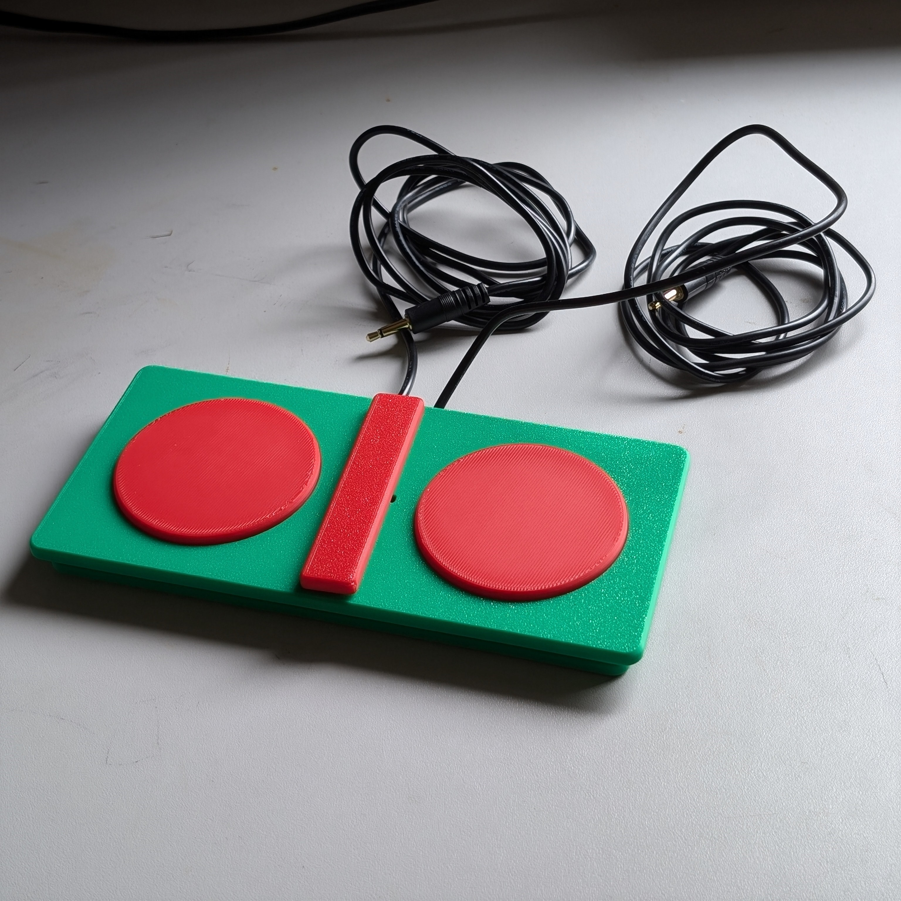

<!--- Open Source Assistive Technology: GitHub Readme Template Version 1.2 (2024-May-27)  --->

<!---
This is a GitHub repository intended to act as a template for an open source assistive technology device. It is meant to contain all design files, build files, and documentation for the project. More information about how to use the template is available in the [Documentation_Guide](/Documentation_Guide.docx). You can see examples of other Open AT Devices at the Makers Making Change [website](https://www.makersmakingchange.com/s/category/assistive-devices). 
--->

 
<!--- TITLE --->
# Open Rocker Switch
<!--- Should match the name of the GitHub repository. Choose something descriptive rather than whimsical.  --->

## Overview
<!--- A brief summary of the project. What it does, who it is for, how much it costs. --->
The Open Rocker Switch is an inexpensive 3D printable accessibility switch. The switch consists of two separate buttons that are activated by pressing on either side. This switch is comparable in size, activation force, and travel to the discontinued AbleNet Rocker Switch. The Open Rocker Switch has interchangeable button pieces and center divider pieces for users to customize and personalize their switch.

<MODIFY LINE AS NECESSARY> The device is comprised of off-the-shelf electronics and 3D printed parts. 

The Open Rocker Switch is open assistive technology (OpenAT). Under the terms of the open source licenses, the device may be built, used, and improved upon by anyone.

The overall cost of materials is about $7 (plus $8 for component shipping).

## Makers Making Change Assistive Device Library
https://www.makersmakingchange.com/s/product/open-rocker-switch/01tJR000000693uYAA

## How to Obtain the Device
### 1. Do-it-Yourself (DIY) or Do-it-Together (DIT)

This is an open-source assistive technology, so anyone is free to build it. All of the files and instructions required to build the device are contained within this repository. Refer to the Maker Guide below.

### 2. Request a build of this device

You may also submit a build request through the [Makers Making Change Assistive Device Library Listing](https://www.makersmakingchange.com/s/product/open-rocker-switch/01tJR000000693uYAA) to have a volunteer maker build the device. As the requestor, you are responsible for reimbursing the maker for the cost of materials and any shipping.

### 3. Build this device for someone else

If you have the skills and equipment to build this device, and would like to donate your time to create the device for someone who needs it, visit the [MMC Maker Wanted](https://makersmakingchange.com/maker-wanted/) section.

## Build Instructions
<!--- Outline the major steps required to create a build --->

### 1. Read through the Maker Guide

The [Maker Guide](/Documentation/Open_Rocker_Switch_Maker_Guide.pdf)  contains all the necessary information to build this device, including tool lists, assembly instructions, programming instructions (if applicable) and testing.

### 2. Order the Off-The-Shelf Components

The [Bill of Materials](/Documentation/Open_Rocker_Switch_BOM.xlsx) lists all of the parts and components required to build the device.

### 3. Print the 3D Printable components

All of the files and individual print files can be found in the [/Build_Files/3D_Printing_Files](/Build_Files/3D_Printing_Files/) folder.

### 4. Assemble the Open Rocker Switch

Reference the Assembly Guide section of the [Maker Guide](/Documentation/Open_Rocker_Switch_Maker_Guide.pdf) for the tools and steps required to build the device.

## How to improve this Device
As open source assistive technology, you are welcomed and encouraged to improve upon the design. 

## Files
### Documentation
<!--- Update the name, link, and version for documentation --->
| Document             | Version | Link |
|----------------------|---------|------|
| Design Rationale     | 2.2     | [Open_Rocker_Switch_Design_Rationale](/Documentation/<Device_Name>_Design_Rationale.pdf)     |
| Maker Guide          | 2.2     | [Open_Rocker_Switch_Maker_Guide](/Documentation/<Device_Name>_Maker_Guide.pdf)     |
| Bill of Materials    | 2.2     | [Open_Rocker_Switch_Bill_of_Materials](/Documentation/<Device_Name>_BOM.xlsx)     |
| User Guide           | 2.2     | [Open_Rocker_Switch_User_Guide](/Documentation/<Device_Name>_User_Guide.pdf)    |
| Changelog            | 2.2     | [Changelog](CHANGES.txt)     |

### Design Files
<!--- Include a copy of the original design files to facilitate easy editing and customization. Consider also including a generic format (e.g., STEP) --->
 - [CAD Files](/Design_Files/CAD_Design_Files)

### Build Files
<!--- Include a copy of the build files intended for manufacturing. This may include svg files for laser cutting, stl files for 3d printing, Gerber files for custom PCBs, and Arduino files for custom firmware. --->
 - [3D Printing Files](/Build_Files/3D_Printing_Files)

## License
<!--- Add the year(s) for the copyright and the Designer Name. You may use the standard set of open licenses or choose your own for the hardware, software, and accompanying materials. --->
Copyright (c) 2024 Neil Squire Society.

This repository describes Open Hardware:
 - Everything needed or used to design, make, test, or prepare the Open Rocker Switch is licensed under the [CERN 2.0 Weakly Reciprocal license (CERN-OHL-W v2) or later](https://cern.ch/cern-ohl ) .
 - Accompanying material such as instruction manuals, videos, and other copyrightable works that are useful but not necessary to design, make, test, or prepare the <Device-Name> are published under a [Creative Commons Attribution-ShareAlike 4.0 license (CC BY-SA 4.0)](https://creativecommons.org/licenses/by-sa/4.0/) .

You may redistribute and modify this documentation and make products using it under the terms of the [CERN-OHL-W v2](https://cern.ch/cern-ohl).
This documentation is distributed WITHOUT ANY EXPRESS OR IMPLIED WARRANTY, INCLUDING OF MERCHANTABILITY, SATISFACTORY QUALITY AND FITNESS FOR A PARTICULAR PURPOSE.
Please see the CERN-OHL-W v2 for applicable conditions.

Source Location: https://github.com/makersmakingchange/Open-Rocker-Switch

## Attribution
<!--- Provide any necessary attribution for designs or components that are included in the device or as part of the project. --->
The device was designed by Neil Squire Society/Makers Making Change. 

<!--- This is the attribution for the template. --->
The documentation template was created by Makers Making Change / Neil Squire Society and is used under a CC BY-SA 4.0 license. It is available at the following link: [https://github.com/makersmakingchange/OpenAT-Template](https://github.com/makersmakingchange/OpenAT-Template)

### Contributors
<!--- List the names of the people that contributed to the design. This could include the original source of the idea, designers, testers, documenters, etc. --->
Designers:
 - Gabriel Chu
 - Jake McIvor
 - Brad Wellington

---

## About Makers Making Change
<!--- This is standard boilerplate for Makers Making Change. No changes should be required. --->

Makers Making Change is a program of [Neil Squire](https://www.neilsquire.ca/), a Canadian non-profit that uses technology, knowledge, and passion to empower people with disabilities.

Makers Making Change leverages the capacity of community based Makers, Disability Professionals and Volunteers to develop and deliver affordable Open Source Assistive Technologies.

 - Website: [www.MakersMakingChange.com](https://www.makersmakingchange.com/)
 - GitHub: [makersmakingchange](https://github.com/makersmakingchange)
 - X (formerly Twitter): [@makermakechange](https://twitter.com/makermakechange)
 - Instagram: [@makersmakingchange](https://www.instagram.com/makersmakingchange)
 - Facebook: [makersmakechange](https://www.facebook.com/makersmakechange)
 - LinkedIn: [Neil Squire Society](https://www.linkedin.com/company/neil-squire-society/)
 - Thingiverse: [makersmakingchange](https://www.thingiverse.com/makersmakingchange/about)
 - Printables: [MakersMakingChange](https://www.printables.com/@MakersMakingChange)

### Contact Us
For technical questions, to get involved, or to share your experience we encourage you to [visit our website](https://www.makersmakingchange.com/) or [contact us](https://www.makersmakingchange.com/s/contact).
